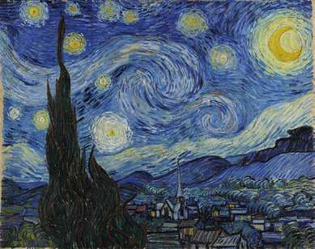

# In Search of the stars...

This is a side-project for [Udacity/Facebook Pytorch Scholarship Challenge](https://sites.google.com/udacity.com/pytorch-scholarship-facebook/community/project-showcase)

In this notebook, I’ll try to *reproduce* an iconic Von Hogh "Starry Night" style transfer from the the paper, [Image Style Transfer Using Convolutional Neural Networks, by Gatys](https://www.cv-foundation.org/openaccess/content_cvpr_2016/papers/Gatys_Image_Style_Transfer_CVPR_2016_paper.pdf). This is the style transfer that uses a famouse Von Hogh masterpiece "Starry Night" as the style and a Tuebinger Neckarfront foto as the content:

<table><tr>
<td>  </td>
<td>  </td>
</tr>
</table>
    
Result of style transfer:

 

In this paper, pre-trained VGG19 is used, and there are few hyperparameters to tune, see below. I wanted to obtain the same style transfer as reported in the paper. I have read the article and set the hyperparameters to those values mentioned in the paper. I could get some cool-looking target images, but they were all _without the stars on the sky_! 

 

I made a conclusion that I can not reproduce the article result, which is a big deal for science. I started to wonder why? Some obviouse thoughts were that hyperparameters are wrong. Could be that different source picture contained different pixel values due to different transformations and this really affected the outcome. Some other thoughts were that VGG19's weights are now different from those used by the article authors.

So, I wanted to find a correct set of hyperparameters that will reproduce the article, i.e. I aim to generate the same image they show as their generated target.

## Hyperparameters

### style_weights

They define weights for extracted from VGG19 layers that are used for generating the target picture.

Example:

'''
style_weights = {'conv1_1': 0.2,
                 'conv2_1': 0.2,
                 'conv3_1': 0.2,
                 'conv4_1': 0.2,
                 'conv5_1': 0.2}
'''

### content_weight, style_weight

They are mentioned in the arcticle as alpha and beta and define relative weight of style and content applied to the target image.

Example:

content_weight = 1  # alpha
style_weight = 1/8e-2  # beta

### steps

The number of iterations of target picture.

Example:

steps = 20000

### optimizer and its parameters

Different optimizers can be used during iterations.

Example:

`optimizer = optim.LBFGS([target], lr=0.2)`

`optimizer = optim.Adam([target], lr=0.01)`

## Running the experiment

For hyperparameter search Ray Tune library was used.

Each trial was conducted with 5000 steps, taking approximately 180 seconds on GTX 1080ti. The number of steps was chosen to give sufficient time for start to "develop" on the target image.

As metric, MAE between generated target image and the true target (the one from the article was used. We were aiming at the lowest MAE, with 0 meaning perfect match of our generated image and the desired target image.

## Experiment results

By the deadline, only limited number of trials was conducted. This is due to large search space and time per trial. I resorted to sampling only every 10th of style transfer conbinations, and 3 content weight parameters. This gave 39 trials. 

Unfortunately no image with stars was generated.

Genrated pictures along with there hyperparameters are shown below.

## Future research

Here are some ideas for the future experiments

* run full expriment with all style_weigh combinations
* try grid_searh of an optimizer params
* try different optimizers 

## Disclaimer

In this notebook, code from [Style Transfer Excersize notebook](https://github.com/udacity/deep-learning-v2-pytorch/blob/master/style-transfer/Style_Transfer_Exercise.ipynb) of [Udacity/deep-learning-v2-pytorch](https://github.com/udacity/deep-learning-v2-pytorch) is heavily borrowed. 

Please see their notebook to get explanation on style transfer method. In my notebook, style transfer metod is not described in comments.
